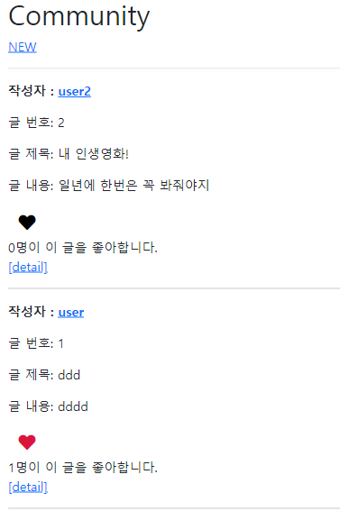
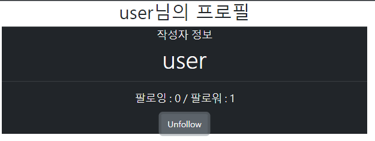
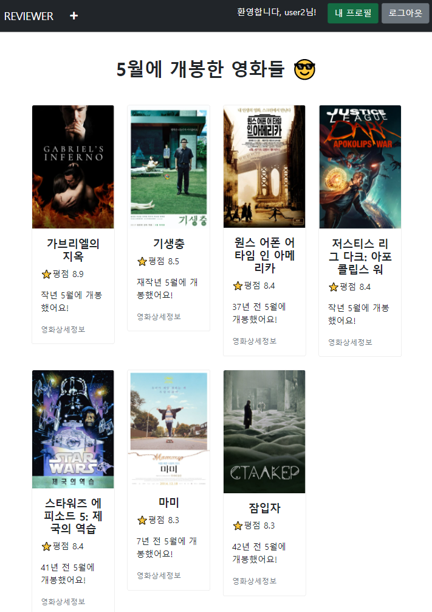
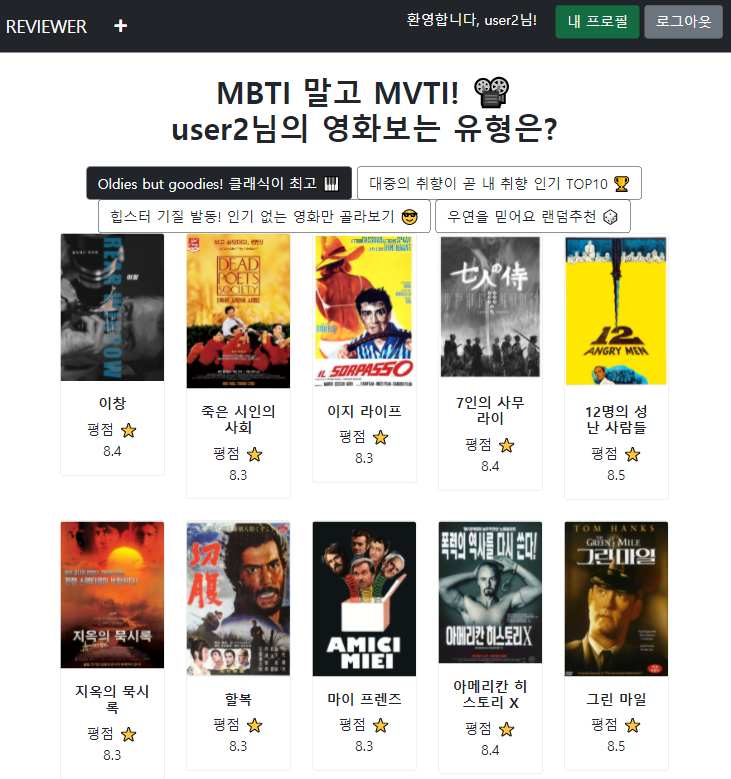
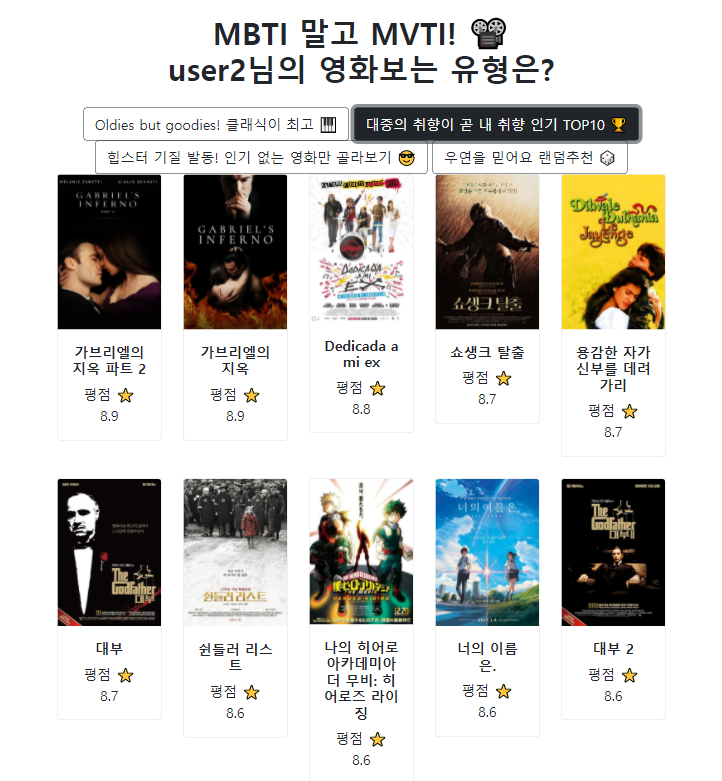
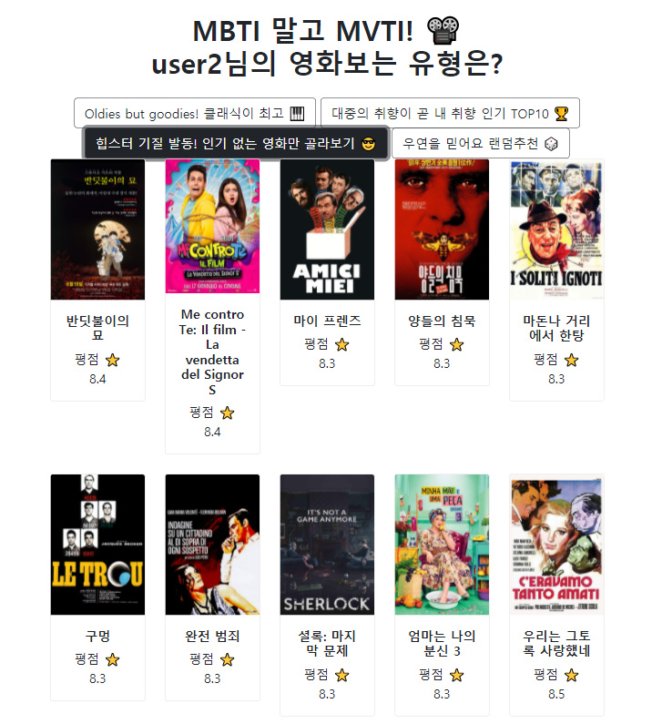
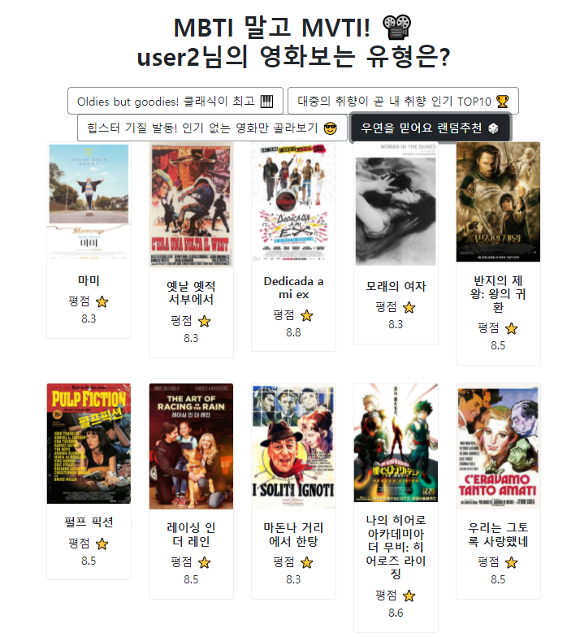

# Project 09_알고리즘을 적용한 서버 구성

## 0. 개발 환경

- Python 3.8.7
- Django 3.2
- SQLite3

## 1. 프로젝트 소개

- **진행 일시**: 2021.05.07 (금)
- **프로젝트 내용**
  - AJAX 통신을 활용한 좋아요, 팔로우 기능 개선
  - 영화 추천 알고리즘 구현
- **역할 분담**: 페어인 권소영님과 `navigator` / `driver` 역할 번갈아가며 담당

## 2. 문제 해결 과정

### a. 좋아요 기능

> [community/index.html 바로가기](community/templates/community/index.html)

- 수업시간과 달랐던 부분은 '좋아요' / '좋아요 취소' 버튼 대신 하트가 보이게 구현하는 것이었다.
- 따라서 `innerHTML` 로 버튼에 `i` 태그를 집어넣었다.

- 결과 사진

  

### b. 팔로우 기능

> [accounts/_follow.html 바로가기](accounts/templates/accounts/_follow.html)
- Follow / Unfollow 문구와 버튼 색이 동시에 바뀌도록 구현해야 했다.

- `setAttribute` 는 3항 연산자가 불가능 할 것 같아서 text 부분은 3항연산자로, button class 부분은 따로 조건문으로 구현했다.

- 소소하게 삽질했던건 `followCountStatus.innerText = '팔로잉 : ${followingsCount} / 팔로워 : ${followersCount}'` 부분에서 `'`(원래 백틱인데 마크다운 때문에 작은 따옴표로 표현)를 안 쓰는 바람에 팔로우 버튼을 눌러도 버튼 상태가 바뀌지 않는 오류가 생겼다... 😂

- 결과 사진

  

  

### c. 영화 추천 알고리즘 (1)

> [movies/recommended.html 바로가기](movies/templates/movies/recommened.html)
>
> 인스타그램의 'n년 전 오늘' 기능을 참고해서 'n년 전 이번 달'에 개봉한 영화들을 추천하는 알고리즘을 구현했다.

1. python의 `datetime` 라이브러리를 활용하여 현재 날짜에서 '월' 정보를 추출한다.

2. `release_date`의 월이 현재 월과 같은 영화들만을 필터링한다.

3. 한 단계 더 나아가서 영화의 개봉년도가 올해와 몇 년 차이 나는지를 보여준다.

   - 이 부분이 가장 어려웠다. 처음에는 단순히 (현재-개봉년도) 값을 리스트에 담아서 context로 보낸 후 for문으로 순차적으로 꺼내려고 했다. 그러나 for문을 병렬적으로 둘 수 없기 때문에 안 될 것이라고 결론 내렸다.
   - 두번째로 생각해 낸 방법은 필터링된 영화들의 (영화id, 연도차이)를 튜플 상태로 리스트로 담아서 보낸 다음, 영화마다 리스트를 돌면서 튜플의 0번째 값이 각 영화의 pk 값과 같을 때 그 튜플의 1번째 값을 보여주는 방식이었다. 하지만 DTL에서는 인덱스 접근이 되지 않아 실패했다.
   - Django 공식문서를 둘러보다가 DTL에서 딕셔너리 타입의 key, value를 꺼낼 수 있다는 점을 발견했다. 그래서 리스트를 `{영화id: 연도차이}` 형식의 딕셔너리로 변환하여 각 영화의 pk값에 해당하는 value를 보여지게 했다. 결과는 성공!
   - 나름의 humanize를 위해 1년 전 영화는 `작년`, 2년 전 영화는 `재작년`으로 보이게 조건분기했다.

4. 결과 사진

   

### d. 영화 추천 알고리즘 (2)

> [movies/recommended2.html 바로가기](movies/templates/movies/recommened2.html)
>
> 알고리즘 (1)만 만들기는 아쉬워서 수업 종료 후 혼자 만들어 본 알고리즘이다. 한마디로 'MVTI!'
>
> 꽤 오랜시간 유행한 MBTI를 패러디해서 유형별로 영화를 추천해주는 알고리즘을 만들어봤다.

1. 유형은 총 네 가지, 클래식 유형 / TOP10 유형 / 힙스터 유형 / 랜덤 유형 이 있다.

2. 유형별 버튼은 각각 `params`에 다른 `answer`을 가지고 요청을 보낸다.

3. `views.py`의 `mvti` 함수는 이 요청에 따라 영화를 필터링 한다.

   1. 클래식 유형: 2000년 이전에 개봉한 영화들 중 랜덤으로 10개
   2. TOP10 유형: 평점이 높은 순으로 10개
   3. 힙스터 유형: `popularity` 지수가 낮은 순으로 상위 10개
   4. 랜덤 유형: 전체 영화 중 랜덤으로 10개

   - 처음에는 queryset이 유사 리스트라 생각해서 python의 random 함수를 이용하려고 했으나, 찾아본 결과 `order_by('?')` 를 사용하여 랜덤 추출했다.

4. 필터링한 영화를 `movie_list`에 각각 dictionary 형태로 담은 후, 이를 response에 담는다.

5. response를 json으로 변환하여 리턴한다.

6. `card group`으로 만들기 위해 `forEach` 함수를 사용하여 필요한 `div` 등의 태그를 생성한 다음 알맞은 `class`를 부여하고, 리턴받은 리스트의 요소들을 담는다.

   - 이 부분에서 굉장한 노가다가 이루어졌다... vue.js 를 처음 배울 때 vanila js의 노가다성을 여실히 느낄 수 있었다. 😅

7. 해결되지 않은 점: 각 버튼을 누를 때마다 새로운 영화 10개가 떠야 하는데, 기존에 떠 있는 영화가 없어지지 않고 그 밑으로 10개가 붙어버린다. `removeChild`를 일일이 해줘야 하는건가...? 😨

8. 결과사진

   1. 클래식 유형

   

   

   2. TOP10 유형

   

   

   3. 힙스터 유형

   

   

   4. 랜덤 유형

   

## 3. 후기

💡 **총평**: 자바스크립트에 충분히 익숙하지 않은 상태라서 생각보다 자바스크립트를 많이 활용하지 못한 것 같아 아쉽다. 그래도 페어와 함께 생각해 본 알고리즘을 직접 구현한건 뿌듯하다. 겉으로는 간단한 알고리즘 같아 보이지만, 속은 결코 간단하지 않았던 우리의 알고리즘... 그래도 공식문서 찾아가며 스스로 해결해내서 기쁘다. 

**🙂 잘한 점**

- 힘들었던 구현을 포기하지 않고 끝까지 붙잡아서 해낸 점
- 혼자서 다른 추천 알고리즘을 구현해본 점

**🙁 아쉬운 점**

- 추천 알고리즘(1) 에 한단계 더 나아가서 현재 월뿐만 아니라 원하는 달을 선택하면 그 달에 개봉한 영화를 보여주는 것까지 구현해보고 싶었으나, 부족한 js와 Vue.js 실력+시간으로 인해 하지 못한 점